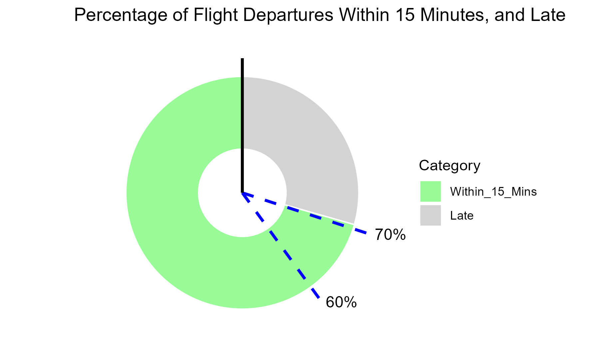

```{r setup, include = FALSE}

knitr::opts_chunk$set(echo = TRUE)
knitr::opts_chunk$set(message = FALSE)


# Specify required libraries
library(dplyr)
library(ggplot2)
library(knitr)
library(kableExtra)
library(lubridate)
library(readr)
#library(AirportAnalysis)


# Plotting function for bar charts.
plot_bar_chart <- function(data, x, y, lab_x, lab_y, title) {
  ggplot(data, aes(x = reorder({{ x }}, {{ y }}), y = {{ y }})) +
    geom_bar(stat = "identity", fill = "skyblue", width = 0.5) +
    labs(x = lab_x, y = lab_y) +
    ggtitle(title) +
    theme_minimal() +
    theme(axis.text.x = element_text(angle = 45, hjust = 1))
}


# Define Delays function
get_delays <- function(directory, threshold) {
  
  # Function body
  # Get a list of all CSV files in the directory
  csv_files <- list.files(directory, pattern = "*.csv", full.names = TRUE)
  
  # Filter the files based on the last 8 digits
  filtered_files <- csv_files[grepl("_[0-9]{4}_[0-9]{4}\\.csv$", csv_files)]
  
  # Extract the numeric values from the file names
  numeric_values <- sub(".*_([0-9]{4})_([0-9]{4})\\.csv$", "\\1\\2", filtered_files)
  
  # Convert the numeric values to integers
  numeric_values <- as.integer(numeric_values)
  
  # Filter the files based on the numeric values
  selected_files <- filtered_files[numeric_values >= threshold]
  
  # Read the selected CSV files
  data <- lapply(selected_files, read_csv)
  
  # Combine the individual data frames into a single data frame
  combined_data <- bind_rows(data) %>%
    distinct(arr_iata, dep_time, .keep_all = TRUE)
  
  
  # Calculate average delay time
  average_delay <- round(mean(combined_data$delayed, na.rm = TRUE), 0)
  
  # Calculate proportion of flights which are delayed
  proportion_delayed <- 1 - sum(is.na(combined_data$delayed)) / nrow(combined_data)
  proportion_delayed <- as.double(proportion_delayed)
  
  return(list(average_delay, proportion_delayed, combined_data))
  
}


# User defined function for plotting delays info
analyse_delays <- function(directory, threshold) {
  
  delays <- get_delays(directory, threshold)
  
  test <- delays[[3]] %>%
    group_by(airline_iata) %>%
    mutate(total_flights = n()) %>%
    filter(!is.na(delayed)) %>%
    arrange(desc(delayed)) %>%
    left_join(airlines, by = c("airline_iata" = "iata_code")) %>%
    filter(!is.na(name)) %>%
    select(airline_iata, name, total_flights, delayed)
  
  # Airlines with most delays (Total)
  
  chart1 <- test %>%
    count(name) %>%
    arrange(desc(n)) %>%
    head(10) %>%
    mutate(name = factor(name, levels = name)) %>%
    ggplot(aes(x = reorder(name, n), y = n, fill = name)) +
    geom_bar(stat = "identity") +
    labs(x = "Airline", y = "Number of Delays", title = "Number of Delays per Airline") +
    theme(axis.text.x = element_text(angle = 45, hjust = 1)) +
    guides(fill = guide_legend())
  
  # Airlines with longest delay times (Total)
  quick_fix <- test %>%
    group_by(name) %>%
    summarize(average_delay = mean(delayed)) %>%
    slice_max(order_by = average_delay, n = 10) 
  
  chart2 <- quick_fix %>%
    ggplot(aes(x = reorder(name, average_delay), y = average_delay, fill = name)) +
    geom_bar(stat = "identity") +
    labs(x = "Airline", y = "Average Delay Time (minutes)", title = "Top Airlines: Average Delay Time") +
    theme(axis.text.x = element_text(angle = 45, hjust = 1)) +
    scale_fill_discrete(guide = guide_legend(reverse = TRUE))
  
  # Worst performing airlines amongst biggest airlines
  # Calculate total flights, number of delays, and average delay per airline
  table <- test %>%
    group_by(name) %>%
    reframe(total_flights = total_flights,
            num_delays = sum(!is.na(delayed)),
            average_delay = mean(delayed, na.rm = TRUE)) %>%
    mutate(proportion_delayed = round(num_delays / total_flights, 2)) %>%
    arrange(desc(total_flights)) %>%
    distinct() %>%
    head(10) %>%  # Define Sensible threshold. Azerbaijan airlines had one flight and one delay
    arrange(desc(proportion_delayed))
    
  chart3 <- table %>%  
    ggplot(aes(x = reorder(name, proportion_delayed), y = proportion_delayed, fill = average_delay)) +
    geom_bar(stat = "identity") +
    labs(x = "Airline", y = "Proportion of Flights Delayed", title = "Worst Performing Airlines: Proportion of Flights Delayed") +
    scale_fill_viridis_c(option = "A", direction = -1) +
    theme(axis.text.x = element_text(angle = 45, hjust = 1))
  
  return(list(chart1, chart2, chart3, table, quick_fix))
  
}


# Data loading
# Load the {airport} departures data
departures_dd <- read.csv(file.path("..", "..", "Markdown", "Data", "{airport}_departures_dd.csv"))

# Load airline data from "Raw Data" location
airlines <- read.csv(file.path("..", "..", "Raw_Data", "airlines.csv"))


```

<section style="border-top: 1px solid black;"></section>

# Introduction

This analysis focuses on the {airport} departures dataset. The dataset contains information about the number of departures to different airports from {airport_name}. We will explore the top destinations and categorize them as domestic or international flights.  

#### **Questions to be answered**

1. Where are the most popular destinations for outbound flights?
2. What proportion of flights are international vs. domestic?
3. Which airlines are the most prominent?
4. What are the most popular times of day for flights to depart?  

<section style="border-top: 1px solid black;"></section>

#### **What are the most popular destinations for outgoing flights from {airport_name}?**

To determine the most popular destinations for outgoing flights from {airport_name}, we have analyzed the dataset and identified the top 10 destinations based on the number of departures.

<section style="border-top: 1px solid black;"></section>

```{r top_destinations, echo = FALSE}

# Create the bar chart with ordered bars
top_airports <- departures_dd %>%
  arrange(desc(top_airports)) %>%
  filter(!is.na(airline_name)) %>%
  distinct(airport_name, top_airports, .keep_all = TRUE) %>%
  head(10)

# Call plotting function to display
plot_bar_chart(top_airports, airport_name, top_airports,
               "Airport", "Number of Departures",
               "Top 10 Most Popular Airports Destinations")


```

<section style="border-top: 1px solid black;"></section>

The bar chart above displays the top 10 most popular airport destinations based on the number of daily departures from {airport_name}. The airports are ranked by the number of departures, with the highest number at the top.

As we can see from the chart, the most popular destination for outgoing flights from {airport_name} is **`r top_airports$airport_name[1]`**, with a total of **`r top_airports$top_airports[1]`** departures.

<section style="border-top: 1px solid black;"></section>

#### **What is the proportion of Domestic flights compared to International flights leaving the airport?**

To understand the distribution of flights leaving the airport, we have analysed the proportion of domestic and international flights.

<section style="border-top: 1px solid black;"></section>

```{r pie_chart, echo = FALSE}

# Perform data manipulation to return proportions
flight_proportions <- departures_dd %>%
  group_by(destination) %>%
  summarize(total = n()) %>%
  mutate(proportion = round(total / sum(total), 2))


# Render the table using kable
kable(flight_proportions, format = "html", caption = "Proportion of Domestic Vs International Flights") %>%
  kable_styling(bootstrap_options = "striped")


# Create the pie chart showing domestic / international split
ggplot(flight_proportions, aes(x = "", y = proportion, fill = destination)) +
  geom_bar(stat = "identity", width = 1) +
  coord_polar("y", start = 0) +
  scale_fill_manual(values = c("Domestic" = "turquoise", "International" = "pink")) +
  theme_void() +
  labs(fill = "Flight Type") +
  ggtitle("Proportion of Domestic vs International Flights") +
  geom_text(aes(label = paste0(round(proportion * 100), "%")), position = position_stack(vjust = 0.5))


```

<section style="border-top: 1px solid black;"></section>

The table above shows the proportion of domestic and international flights leaving the airport. It provides insights into the balance between domestic and international air traffic.

As we can see, **`r round(sum(flight_proportions[flight_proportions$destination == "Domestic", "proportion"]) * 100, 2)`%** of the flights leaving the airport are **domestic**, while **`r round(sum(flight_proportions[flight_proportions$destination == "International", "proportion"]) * 100, 2)`%** are **international**.

<section style="border-top: 1px solid black;"></section>

#### **What are the top 10 most popular airlines departing the airport?**

To analyze the popularity of airlines, we have selected the top 10 airlines based on the number of departures. The list is arranged in descending order, with the highest number of departures at the top.

<section style="border-top: 1px solid black;"></section>

```{r top_airlines, echo = FALSE}

# Select the top 10 airlines and reorder them by number of departures
top_airlines <- departures_dd %>%
  select(-c(airport_name, top_airports, destination, dep_time)) %>%
  filter(!is.na(airline_name)) %>%
  distinct() %>%
  select(airline_name, top_airlines) %>%
  arrange(desc(top_airlines)) %>%
  head(10) %>%
  as.data.frame()


# Create the bar chart with ordered bars
plot_bar_chart(top_airlines, airline_name, top_airlines,
               "Airline", "Number of Departures",
               "Top 10 Most Popular Airlines")


```

<section style="border-top: 1px solid black;"></section>

The bar chart above displays the top 10 most popular airlines based on the number of departures. It provides insights into the prominence of different airlines at {airport_name}.  

As we can see, the most popular airline based on the number of departures is **`r top_airlines$airline_name[1]`**, with **`r top_airlines$top_airlines[1]`** outgoing flights.

<section style="border-top: 1px solid black;"></section>

#### **What are the busiest times of day?**

To identify the most popular times of day for flights to depart, we have analyzed the dataset and categorized the departure times into hourly time slots.

<section style="border-top: 1px solid black;"></section>

```{r peak_hours, echo = FALSE}

# Use 24 hour clock format for this exercise
peak_hours <- departures_dd %>%
  select(dep_time) %>%
  mutate(dep_time = as.POSIXct(dep_time)) %>%
  mutate(timeslot = floor_date(dep_time, "hour")) %>%
  mutate(timeslot = format(timeslot, format = "%H")) %>%
  group_by(timeslot) %>%
  summarize(total = n()) %>%
  arrange(-desc(as.numeric(timeslot)))

# Convert timeslot to a factor with ordered levels
peak_hours$timeslot <- factor(peak_hours$timeslot, levels = unique(peak_hours$timeslot), ordered = TRUE)

# Generate a data frame with all hours
all_hours <- data.frame(timeslot = sprintf("%02d", 0:23))

# Merge all_hours with peak_hours
merged_data <- merge(all_hours, peak_hours, by = "timeslot", all.x = TRUE)

# Fill missing values with 0
merged_data$total[is.na(merged_data$total)] <- 0

# Convert timeslot to a factor with ordered levels
merged_data$timeslot <- factor(merged_data$timeslot, levels = unique(merged_data$timeslot), ordered = TRUE)

# Plot the time series bar chart with adjusted x-axis labels
ggplot(merged_data, aes(x = timeslot, y = total)) +
  geom_bar(stat = "identity", fill = "seagreen") +
  scale_x_discrete(breaks = merged_data$timeslot[seq(1, nrow(merged_data), by = 2)], 
                   labels = function(x) paste0(x, ":00")) +
  labs(x = "Timeslot", y = "Total") +
  ggtitle("Time Series Bar Chart Showing Airport Peak Hours by departures per hour") +
  theme_minimal()


```

<section style="border-top: 1px solid black;"></section>

The time series bar chart above illustrates the distribution of departures per hour, highlighting the busiest periods at the airport. Each bar represents a one-hour time slot, and the height of the bar represents the total number of departures during that time slot.

Based on the chart, the busiest time of day for departures from {airport_name} is **`r paste0(peak_hours$timeslot[which.max(peak_hours$total)], ":00")`**. The number of flights departing at this time is: **`r peak_hours$total[which.max(peak_hours$total)]`**. During this period, there is a significant surge in departures, indicating a high level of activity at the airport.

Conversely, the quietest time of day for departures is **`r paste0(peak_hours$timeslot[which.min(peak_hours$total)], ":00")`**. The number of flights departing at this time is: **`r peak_hours$total[which.min(peak_hours$total)]`**. During this period, the number of departures is relatively low, indicating a more peaceful and less crowded environment at the airport.

<section style="border-top: 1px solid black;"></section>

```{r delays, echo = FALSE}


directory <- file.path("..", "..", "Raw_Data", "{airport}")
threshold <- 6062300  # First time stamp where delay data was collected
delays <- get_delays(directory, threshold)

```

#### **Delays**

Additionally, we analyzed the average delay time and the proportion of delayed flights at {airport_name}.

<section style="border-top: 1px solid black;"></section>

We determined the proportion of flights that experienced delays. The analysis revealed that approximately **`r round(delays[[2]], 3) * 100`%** of flights departing from {airport_name} experienced some form of delay. This metric is crucial for understanding the reliability and punctuality of flight operations at the airport. It highlights the importance of implementing strategies and measures to minimize delays, enhance passenger satisfaction, and ensure smooth travel experiences.

For the delayed flights, The average delay time was calculated to be approximately **`r delays[[1]]`** minutes. This code metric provides an understanding of the overall time passengers can expect to wait for departures, taking into account any delays that may occur. It serves as a valuable performance indicator for the airport and can be used to identify areas for improvement in terms of efficiency and reducing delays.

By examining the average delay time and the proportion of delayed flights, {airport_name} can assess its performance in terms of timeliness and take appropriate measures to improve operational efficiency and minimize disruptions for passengers.

<section style="border-top: 1px solid black;"></section>

```{r num_delays, echo = FALSE}


# Same as for delays - this time use analyse_delays function
directory <- file.path("..", "..", "Raw_Data", "{airport}")
threshold <- 6062300  # First time stamp where delay data was collected

output <- suppressWarnings(analyse_delays(directory, threshold))

print(output[[1]])

# Placeholders to reference in the narrative
highest_delay_index <- which.max(output[[4]]$num_delays)
highest_num_delays <- round(output[[4]]$num_delays[highest_delay_index], 2)
highest_num_delays_name <- output[[4]]$name[highest_delay_index]


```

<section style="border-top: 1px solid black;"></section>

This chart shows the number of delays per airline. The x-axis represents the airlines, and the y-axis represents the number of delays. The bars represent each airline, and their heights correspond to the number of delays. The chart helps visualize which airlines have the highest number of delays. The airline with the highest number of delays is **`r highest_num_delays_name`**, with **`r highest_num_delays`** flights delayed.

<section style="border-top: 1px solid black;"></section>

```{r average_delay_time, echo = FALSE}

print(output[[2]])

# Assuming `output` is a list containing multiple elements
highest_delay_index2 <- which.max(output[[5]]$average_delay)
highest_average_delay <- round(output[[5]]$average_delay[highest_delay_index2], 2)
highest_average_delay_name <- output[[5]]$name[highest_delay_index2]


```

<section style="border-top: 1px solid black;"></section>

This chart displays the top airlines based on average delay time. The x-axis represents the airlines, and the y-axis represents the average delay time in minutes. The bars represent each airline, and their heights represent the average delay time. The airline with the longest average delay time is **`r highest_average_delay_name `** with an average delay time of **`r highest_average_delay  `** minutes.

<section style="border-top: 1px solid black;"></section>

```{r delay_proportions_table, echo = FALSE}

output[[4]] <- output[[4]] %>%
  mutate(average_delay = round(average_delay, 2))

# Render the table using kable
kable(output[[4]], format = "html", caption = "Highest proportions of delays per flight") %>%
  kable_styling(bootstrap_options = "striped")

```

<section style="border-top: 1px solid black;"></section>

The table presents the worst performing airlines based on the proportion of flights delayed. It includes columns for the airline name, total number of flights, number of delays, average delay time, and the proportion of flights delayed. The table helps to identify airlines with the highest proportions of delays per flight.

<section style="border-top: 1px solid black;"></section>

```{r delay_proportions_chart, echo = FALSE}

print(output[[3]])

```

<section style="border-top: 1px solid black;"></section>

This chart shows the proportion of flights delayed for the worst performing airlines. The x-axis represents the airlines, and the y-axis represents the proportion of flights delayed. The bars represent each airline, and their lengths represent the proportion of delays. The airline with the highest proportion of flights delayed is **`r output[[4]]$name[1]`** with a proportion of **`r output[[4]]$proportion_delayed[1]`** delays per flight.

<section style="border-top: 1px solid black;"></section>

#### **Live Flight Data - proportion of flights running on time**

<section style="border-top: 1px solid black;"></section>


<section style="border-top: 1px solid black;"></section>


